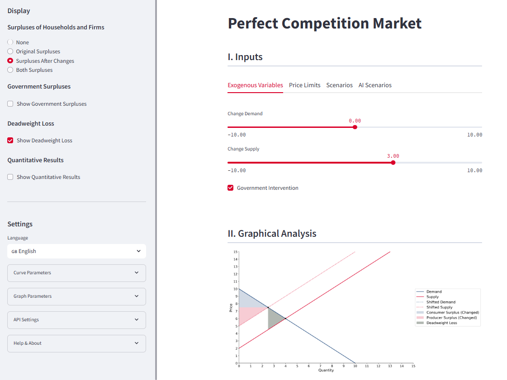

# MARKET SIMULATOR




# Language / Sprache
This Readme file is available in two languages.
Dieses Readme is in zwei Sprachen verfügbar.

🇩🇪 [Deutsch](#deutsch) | 🇬🇧 [English](#english)

# Deutsch

## Überblick

Der Market Simulator ermöglicht, im **Modell des vollkommenen Wettbewerbsmarktes Änderungen der exogenen Variablen zu analysieren**, also zum Beispiel die Auswirkungen von Steuern und Subventionen, Änderungen der Faktorpreise oder der Zahlungsbereitschaft der Konsumenten. Auch kann simuliert werden, welche Effekte die Einführung von Mindest- oder Höchstpreisen hat. Dabei werden die neuen Gleichgewichtspreise und Gleichgewichtsmengen sowie die Veränderungen der Konsumentenrente, der Produzentenrente und der Gesamtwohlfahrt errechnet und dargestellt. Auch eine Analyse von Steuer-/Subveventionsinzidenzen ist möglich.

## Inhaltsverzeichnis
- [MARKET SIMULATOR](#market-simulator)
- [Language / Sprache](#language--sprache)
- [Deutsch](#deutsch)
  - [Überblick](#überblick)
  - [Inhaltsverzeichnis](#inhaltsverzeichnis)
  - [An wen richtet sich der Market Simulator?](#an-wen-richtet-sich-der-market-simulator)
  - [Was kann der Market Simulator?](#was-kann-der-market-simulator)
    - [Kernfunktionen für den Benutzer (zum Beispiel Student, Dozent)](#kernfunktionen-für-den-benutzer-zum-beispiel-student-dozent)
    - [Kernfunktionen für den Bereitsteller (zum Beispiel Universität)](#kernfunktionen-für-den-bereitsteller-zum-beispiel-universität)
  - [Wie kann ich als Benutzer den Market Simulator verwenden?](#wie-kann-ich-als-benutzer-den-market-simulator-verwenden)
    - [Aufbau der Benutzeroberfläche](#aufbau-der-benutzeroberfläche)
    - [Anpassung der Grundeinstellungen](#anpassung-der-grundeinstellungen)
      - [Anzeigeeinstellungen](#anzeigeeinstellungen)
      - [Kurvenparameter](#kurvenparameter)
      - [Grafische Darstellung](#grafische-darstellung)
    - [Simulation von Marktveränderungen](#simulation-von-marktveränderungen)
      - [Manuelle Simulationen](#manuelle-simulationen)
      - [Verwendung vordefinierter Szenarien (abhängig vom Bereitsteller)](#verwendung-vordefinierter-szenarien-abhängig-vom-bereitsteller)
      - [KI-gestützte Analyse (abhängig vom Bereitsteller)](#ki-gestützte-analyse-abhängig-vom-bereitsteller)
    - [Sprache und Internationalisierung](#sprache-und-internationalisierung)
    - [Tipps für die effektive Nutzung](#tipps-für-die-effektive-nutzung)
  - [Wie kann ich als Institution (oder Dozent) den Market Simulator selber betreiben und customizen?](#wie-kann-ich-als-institution-oder-dozent-den-market-simulator-selber-betreiben-und-customizen)
    - [Hosting](#hosting)
    - [Konfiguration und Customizing](#konfiguration-und-customizing)
    - [Arbeit mit vorgefertigten Szenarien](#arbeit-mit-vorgefertigten-szenarien)
    - [Arbeit mit künstlicher Intelligenz](#arbeit-mit-künstlicher-intelligenz)
    - [Arbeit mit neuen/zusätzlichen Sprachen](#arbeit-mit-neuenzusätzlichen-sprachen)
  - [Fragen, Anregungen, Pull Requests, Development Roadmap](#fragen-anregungen-pull-requests-development-roadmap)
  - [Lizenz](#lizenz)
- [English](#english)
  - [Overview](#overview)
  - [Table of Contents](#table-of-contents)
  - [Who is the Market Simulator for?](#who-is-the-market-simulator-for)
  - [What can the Market Simulator do?](#what-can-the-market-simulator-do)
    - [Core Features for Users (e.g., Students, Lecturers)](#core-features-for-users-eg-students-lecturers)
    - [Core Features for Providers (e.g., Universities)](#core-features-for-providers-eg-universities)
  - [How can I use the Market Simulator as a user?](#how-can-i-use-the-market-simulator-as-a-user)
    - [Interface Layout](#interface-layout)
    - [Customizing Basic Settings](#customizing-basic-settings)
      - [Display Settings](#display-settings)
      - [Curve Parameters](#curve-parameters)
      - [Graphical Representation](#graphical-representation)
    - [Simulating Market Changes](#simulating-market-changes)
      - [Manual Simulations](#manual-simulations)
      - [Using Predefined Scenarios (depending on the provider)](#using-predefined-scenarios-depending-on-the-provider)
      - [AI-Powered Analysis (depending on the provider)](#ai-powered-analysis-depending-on-the-provider)
    - [Language and Internationalization](#language-and-internationalization)
    - [Tips for Effective Use](#tips-for-effective-use)
  - [How can I, as an institution (or lecturer), operate and customize the Market Simulator?](#how-can-i-as-an-institution-or-lecturer-operate-and-customize-the-market-simulator)
    - [Hosting](#hosting-1)
    - [Configuration and Customization](#configuration-and-customization)
    - [Working with Predefined Scenarios](#working-with-predefined-scenarios)
    - [Working with Artificial Intelligence](#working-with-artificial-intelligence)
    - [Working with New/Additional Languages](#working-with-newadditional-languages)
  - [Questions, Suggestions, Pull Requests, Development Roadmap](#questions-suggestions-pull-requests-development-roadmap)
  - [License](#license)


## An wen richtet sich der Market Simulator?

Zielgruppe des Market Simulator sind einerseits **Studenten und andere Interessierte**, die das Modell des vollkommenen Wettbewerbsmarktes besser verstehen wollen. Andererseits kann der Market Simulator auch als Hilfsmittel für **Dozenten** dienen, ihren Studenten einen intuitiveren Zugang zum Modell des vollkommenen Wettbewerbsmarktes zu geben, und leicht nachvollziehbare Simulationen in Vorlesungen und Übungen zu integrieren, um die theoretischen Ausführungen greifbarer und verständlicher zu machen.

## Was kann der Market Simulator?

### Kernfunktionen für den Benutzer (zum Beispiel Student, Dozent)
Der Market Simulator stellt Ihnen als Benutzer eine ganze Reihe praktischer Funktionen zur Verfügung (Verfügbarkeit teilweise abhängig von der Konfiguration, die der Bereitsteller vorgenommen hat). Die wichtigsten Features sind:
* Simulation von Verschiebungen der Nachfrage- und/oder der Angebotskurve infolge der Veränderung exogener Variablen
* Simulation der Einführung von Mindest- und Höchstpreisen
* Betrachtung vordefinierter Szenarien (zum Beispiel Faktorpreiserhöhung und infolgedessen Angebotskurvenverschiebung) mit entsprechender verbaler Erläuterung (abhängig vom Bereitsteller)
* Analyse und grafische Aufbereitung von als Freitext eingegebenen Szenarien mit Hilfe künstlicher Intelligenz (abhängig vom Bereitsteller)
* Flexibles An- und Abschalten der Anzeige von Konsumentenrente, Produzentenrente und Gesamtwohlfahrt vor und nach der Veränderung der exogenen Variablen
* Änderung der Kurvenparameter (Achsenabschnitt/Steigung oder Elastizität von Angebots- und Nachfragekurve)
* Steuerung der Grafikanzeige (Achsenskalierung, Gitterlinien)
* Umschalten der Benutzeroberfläche zwischen Deutsch, Englisch, Französisch, Spanisch, Italienisch, Portugiesisch und Niederländisch.

### Kernfunktionen für den Bereitsteller (zum Beispiel Universität)

Als Bereitsteller, der die App für eine Benutzergruppe anbietet, können Sie viele Aspekte des Market Simulators durch entsprechende Konfigurationseinstellungen anpassen und auf Ihre Bedürfnisse zuschneiden; dazu gehören zum Beispiel die Standardsprache der Benutzeroberfläche, die Farben sowie die Verfügbarkeit von Features wie vorgefertigte Szenarien oder Szenarienanalyse mit Hilfe künstlicher Intelligenz (KI). Vorgefertigte Szenarien erlauben es Ihnen, Ihren Anwendern fertige Szenarien zur Benutzung anzubieten (etwa die Erhhöhung der Faktorpreise oder die Einführung einer Steuer), die mit einem erklärenden Text versehen werden können. Durch Freigabe des KI-Features (setzt einen OpenRouter-API-Schlüsselvoraus) können Sie Ihren Anwendern gestatten, eigene Szenarien verbal einzugeben und die künstliche Intelligenz diese Szenarien dann in entsprechende Kurvenverschiebungen übersetzen und verbal erklären lassen.

## Wie kann ich als Benutzer den Market Simulator verwenden?

### Aufbau der Benutzeroberfläche

Der Market Simulator präsentiert sich mit einer **übersichtlichen Benutzeroberfläche**, die in mehrere Bereiche unterteilt ist. Im linken Bereich finden Sie allgemeine Einstellungen, während rechts die eigentliche Simulation gesteuert und deren grafische und quantitative Analyse angezeigt wird. Der rechte Bereich gliedert sich in die *Vorgaben*, die die Simulation definieren, die *grafische Analyse*, die die Simulation grafisch darstellt, und, sofern dies unter den Anzeigeeinstellungen aktiviert ist, die *quantitative Analyse*, mit der zahlreiche numerische Ergebnisse angezeigt (wie Gleichgewichtspreise und -mengen, Kosumenten- und Produzentenrente, Gesamtwohlfahrt, Steuer- und Subventionsinzidenzen) werden können.

### Anpassung der Grundeinstellungen

#### Anzeigeeinstellungen
Sie können den Umfang der Anzeige von Simulationsergebnissen bequem steuern, insbesondere
* ob die Renten der Konsumenten und Produzenten angezeigt werden sollen, und wenn ja, ob nur die Renten in der Ausgangssituation, nur die Renten nach der simulierten Marktveränderung oder beide angezeigt werden sollen
* ob im Falle von Steuern bzw. Subventionen, die Steuereinnahmen bzw. Subventionsausgaben angezeigt werden sollen (diese werden nur angezeigt, wenn links im Bereich *Vorgaben* die Kurvenverschiebung durch die entsprechende Checkbox als Staatseingriff definiert worden ist)
* ob der Wohlfahrtsverlust angezeigt werden soll (dieser wird ebenfalls nur angezeigt, wenn links im Bereich *Vorgaben* die Kurvenverschiebung durch die Checkbox als Staatseingriff definiert worden ist)
* ob die Ergebnisse nicht nur grafisch, sondern auch quantitativ angezeigt werden sollen; dabei werden diejenigen numerischen Ergebnisse angezeigt, die mittels der Anzeigeeinstellungen auch für die Grafik ausgewählt wurden. 

#### Kurvenparameter
Sie können die **grundlegenden Parameter** des Marktmodells anpassen:
* Steigung und Achsenabschnitt der Nachfragekurve
* Steigung und Achsenabschnitt der Angebotskurve
* Elastizität der Nachfragekurve sowie Elastizität der Angebotskurve (dabei wird die Elastizität im Gleichgewicht berechnet bzw. verändert, Steigung und Achsenabschnitte ändern sich entsprechend)

#### Grafische Darstellung
Passen Sie die Darstellung an Ihre Bedürfnisse an:
* Ein-/Ausschalten der **Gitterlinien**
* Anpassung der **Achsenskalierung** (Abstand der Markierungen auf den Achsen)
* **Linienstärke** der Kurven

### Simulation von Marktveränderungen

#### Manuelle Simulationen
Im Bereich *Vorgaben* können Sie Ihre Simulation definieren. Dabei können Sie zwei Arten von Marktveränderungen simulieren:
1. **Verschiebungen der Angebots- und Nachfragekurven**, das heißt, Änderungen der exogenen Variablen
   * Nutzen Sie die Schieberegler unter *Exogene Variablen*, um die Kurven nach links/rechts zu verschieben (es läßt sich jeweils nur eine Kurve verschieben, sobald Sie eine Verschiebung der zweiten Kurve eingeben, wird die Verschiebung der ersten Kurve auf Null zurückgesetzt)
   * Beobachten Sie die unmittelbaren Auswirkungen auf Gleichgewichtspreis und -menge

2. **Preisgrenzen** in Form von Mindest- oder Höchstpreisen
   * Gehen Sie unter *Vorgaben* auf die Registerkarte *Preisgrenzen*
   * Legen Sie den gewünschten Mindest- oder Höchstpreis fest
   * Analysieren Sie die resultierenden Marktungleichgewichte

#### Verwendung vordefinierter Szenarien (abhängig vom Bereitsteller)
Falls vom Bereitsteller aktiviert, können Sie:
* Aus einer **Galerie vorbereiteter Szenarien** wählen
* Die Auswirkungen typischer Markteingriffe mit erläuternden Texten studieren

#### KI-gestützte Analyse (abhängig vom Bereitsteller)
Wenn diese Funktion aktiviert ist, können Sie:
* **Eigene Szenarien als Freitext** eingeben
* Die KI analysiert Ihre Beschreibung und simuliert die entsprechenden Marktveränderungen
* Sie erhalten neben der Grafik und (sofern von Ihnen aktiviert) quantitativen Resultaten auch eine verbale Erklärungen der Marktveränderung

### Sprache und Internationalisierung

* Schalten Sie die Benutzeroberfläche *zwischen unterschiedlichen Sprachen* um; derzeit angeboten werden neben Englisch, Detusch, Französisch, Spanisch, Italienisch, Portugiesisch, Niederländisch, Russisch, Ukrainisch, Hindi, Chinesisch sowie Japanisch.
* Alle Beschriftungen, Erklärungen und die Benutzeroberfläche werden in der gewählten Sprache angezeigt
* Auch die KI-Analyse liefert Ergebnisse in der gewählten Sprache
* Vom Bereitsteller vorgegebene Szenarien bleiben in jener Sprache, in der der Bereitsteller sie eingibt

### Tipps für die effektive Nutzung

* Beginnen Sie mit den **vordefinierten Szenarien**, um sich mit der Funktionsweise vertraut zu machen
* Experimentieren Sie dann mit **eigenen Parametereinstellungen** unter *Exogene Variablen* oder *Preisgrenzen*
* Nutzen Sie die **KI-Analyse** (falls verfügbar) für komplexere Szenarien oder Marktveränderungssituationen, in denen Ihnen die Übersetzung der Fragestellung in Kurvenverschiebungen Schwierigkeiten macht
* Verwenden Sie die **Gitterlinien** und die Anzeige quantitativer Resultate für präzisere Analysen der Gleichgewichtspunkte und Wohlfahrtsveränderungen

## Wie kann ich als Institution (oder Dozent) den Market Simulator selber betreiben und customizen?

### Hosting
Wer selbst den Market Simulator betreiben und seinen Anwendern (zum Beispiel Studenten) bereitstellen möchte, kann das Repository clonen oder forken und die App über Dienste wie [Streamlit Community Cloud](https://share.streamlit.io/) oder [Microsoft Azure Web Apps](https://azure.microsoft.com/en-us/pricing/purchase-options/azure-account?icid=dotnet&ef_id=_k_Cj0KCQjwpvK4BhDUARIsADHt9sRsY9Sh0FA7XGc4K7-3BgIH0Ob9IUxLizwenDdlCH21T_DhRnTcrQAaAvwzEALw_wcB_k_&OCID=AIDcmmzzaokddl_SEM__k_Cj0KCQjwpvK4BhDUARIsADHt9sRsY9Sh0FA7XGc4K7-3BgIH0Ob9IUxLizwenDdlCH21T_DhRnTcrQAaAvwzEALw_wcB_k_&gad_source=1&gclid=Cj0KCQjwpvK4BhDUARIsADHt9sRsY9Sh0FA7XGc4K7-3BgIH0Ob9IUxLizwenDdlCH21T_DhRnTcrQAaAvwzEALw_wcB) hosten. 


### Konfiguration und Customizing
Da die umfassende AGPL-Lizenz dies zuläßt (siehe unten), können Sie als Bereitsteller natürlich Änderungen am Python-Code der App vornehmen. Viele der Konfigurationseinstellungen können aber - ganz ohne Arbeit am Code - bequem in der Datei `config.py` vorgenommen werden. Normalerweise sollte das genügen, um die App für Ihre Zwecke zu konfigurieren und an die Vorgaben Ihrer Institution (vor allem bezüglich Farben, Logos, etc.) anzupassen. Die in der Konfigurationsdatei verfügbaren Einstellungen sind:

**Anzeige**
* `title`: Steuert den Titel der App.
* `logo`: Pfad zu einer Logo-Datei, die auf der Benutzeroberfläche im linken Bereich oberhalb des Titels angezeigt wird. Ist `logo` leer, wird kein Logo angezeigt.
* `max_logo_height`: Steuert die maximale Höhe des Logos auf der Benutzeroberfläche und erlaubt so eine Skalierung des Logos.
* `disclaimer_text`: Es besteht die Möglichkeit eine graue Disclaimer-Box anzuzeigen über dem Logo/Titel anzuziegen. Steuert den Text der Disclaimer-Box. Ist `disclaimer_text` leer, wird die Disclaimer-Box nicht angezeigt.
* `ask_confirmation`: Steuert, ob der Benutzer aufgefordert wird, die Kenntnisnahme des Disclaimer zu bestätigen; nachdem er bestätigt hat, dass er den Disclaimer gelesen hat, wird die Disclaimer-Box in der laufenden Session nicht mehr angezeigt; ist `ask_confirmation` false, wird der Disclaimer dauerhaft angezeigt.
* `demand_slope`, `demand_intercept`, `supply_slope`, `supply_intercept`: Steuern die Anfangswerte für die Steigung und den Achsenabschnitt der Nachfrage- und Angebotskurve (können vom Benutzer geändert werden).
* `supply_color`, `demand_color`, `equilibrium_color`, `deadweightloss_color`, `gov_income_color`, `gov_expenses_color`: Steuern die Farben der einzelnen Kurven und Flächen in der Grafik. Alle Farbwerte sind im RGB-Format als Dreier-Tupel von Zahlen zwischen 0 und 1 definiert.
* `alpha`, `alpha_shift`, `alpha_gov`, `alpha_deadweight_loss`: Steuert die Deckkraft der Grafiken allgemein, die Deckkraft der Kurvenverschiebungen, die Deckkraft der Einnahmen-/Ausgabendarstellung und die Deckkraft des Wohlfahrtsverlustes.
* `default_language`: Steuert die Voreinstellung für die Sprache der Benutzeroberfläche (der Benutzer kann die Sprache jederzeit im Menü ändern).

**Features**
* `use_gallery`: Steuert, ob vorgefertigte Szenarien dem Benutzer angeboten werden.
* `use_ai`: Steuert, ob der Benutzer mit Hilfe künstlicher Intelligenz selbst eingegebene Szenarien analysieren lassen kann.
* `debug_terminal`: Steuert, ob Debug-Ausgaben in der Konsole angezeigt werden. Wenn auf `True` gesetzt, werden die Systemnachricht, die Benutzereingabe, die rohe API-Antwort, der geparste JSON-Ergebnis und alle Zwischenschritte der KI-Analyse in der Konsole ausgegeben. Dies ist nützlich zum Debuggen von Problemen mit der KI-Analyse. Standardwert ist `False`.
* `ai_system_message`: Steuert die Systemnachricht, die der künstlichen Intelligenz als Vorgabe für die Analyse der vom Benutzer eingegebenen Szenarien dient.
* `ai_model`: Steuert das verwendete KI-Modell; die Modellbezeichnungen sind die bei OpenRouter (https://openrouter.ai/) gelisteten, also zum Beispiel `anthropic/claude-3.5-sonnet`.
* `ai_temperature`: "Temperatur" des KI-Modells, stets zwischen 0 und 1, steuert die "Kreativität" der Antworten der AI.

### Arbeit mit vorgefertigten Szenarien

Die Szenarien sind in der Datei `gallery.json` definiert. Diese Datei enthält ein JSON-Objekt, das wiederum aus den einzelnen Szenarien besteht. Jedes Szenario ist ein JSON-Objekt, dessen Name zugleich der Szenarienname ist, der in der Szenarien-Gallerie auf der Benutzeroberfläche angezeigt wird. Die Schlüssel eines Szenarien-JSON-Objekts sind:
* `shift_supply`: Verschiebung der Angebotskurve.
* `shift_demand`: Verschiebung der Nachfragekurve.
* `gov_intervention`: Logischer Wert (true/false), der angibt, ob das Szenario eine Verschiebung der Nachfrage- oder Angebotskurve infolge einer staatlichen Intervention ist. Wichtig, weil nur bei staatlichen Interventionen ein Wohlfahrtsverlust infolge der Verzerrung angezeigt werden.
* `explain_text`: Erläuternder Text, der das Szenario erklärt und die Auswirkungen des Szenarios auf die einzelnen Wohlfahrtskomponenten erläutert.

Es wird erwartet, dass alle Schlüssel vorhanden sind.

Das JSON-Objekt für ein Szenario könnte zum Beispiel so aussehen:
```json
{
    "Rohstoffpreise steigen" : {
        "shift_supply" : 5,
        "shift_demand" : 0,
        "gov_intervention": False,
        "explain_text" : "Weil die Faktorpreise steigen, erhöhen sich für jede produzierte Einheit die Grenzkosten. Die Angebotskurve (die ja für eine einzelne Firma nichts anderes als die Grenzkostenkurve ist) verschiebt sich also nach oben (bzw. nach links, weil die Bedignung 'Preis = Grenzkosten' wegen der gestiegenen Grenzkosten jetzt bereits bei einer geringeren Produktionsmenge erfüllt ist). Das neue Marktgleichgewicht weist infolgedessen einen höheren Preis und eine geringere Menge als das alte Gleichgewicht auf."
    }
}
```

Im Repository finden Sie ein Beispiel für eine `gallery.json`-Datei, die bereits eine ganze Reihe von Szenarien enthält.

### Arbeit mit künstlicher Intelligenz

Möchten Sie als Bereitsteller Ihren Benutzern die Analyse frei eingegebener Szenarien mit Hilfe künstlicher Intelligenz ermöglichen (https://openrouter.ai/), müssen Sie über einen OpenRouter-API-Schlüssel verfügen. Die Benutzung ist kostenpflichtig, wobei sich die Kosten nach den jeweils gültigen Preisen von OpenRouter richten. Der Schlüssel wird in der Datei `secrets.toml` verwaltet. Der Benutzer kann abweichend davon im linken Bereich der Benutzeroberfläche einen eigenen API-Schlüssel eingeben. Dadurch können Sie das Feature auch dann anbieten, wenn Sie keinen API-Schlüssel zentral für alle Benutzer hinterlegen. Wenn Sie einen OpenRouter-API-Schlüssel erzeugen wollen, legen Sie einen zunächst kostenlos einen Account bei OpenRouter. Nachdem Sie einen Schlüssel erzeugt haben, speichern Sie diesen direkt an einem sicheren Ort, da er nach Erzeugung in der OpenRouter-Benutzeroberfläche nicht mehr angezeigt werden kann.

Standardmäßig verwendet die App das Claude Sonne 3.5-Modell von Anthropic mit einer Temperatur von 0.3. Das Systemprompt, das ebenfalls in `config.py` definiert ist, ist darauf abgestimmt. Modell, Temperature und Systemprompt müssen in der Regel nicht angepasst werden.

Die KI-Analyse ist ein experimentelles Feature. Da künstliche Intelligenzen inhärent indeterministische Systeme sind, kann das Ergebnis einer Analyse von einem Durchlauf zum anderen variieren. Auch kann die KI Fehler bei der Interpretation des vom Benutzer eingegebenen Szenarios machen oder die Antwort verweigern, obwohl die Benutzereingabe ein valides Szenario darstellt. Weisen Sie Ihre Benutzer auf diese Beschränkungen hin.

### Arbeit mit neuen/zusätzlichen Sprachen
Die Benutzeroberfläche von Market Simulator kommt in 12 verschiedenen Sprachen (Deutsch, Englisch, Französisch, Spanisch, Italienisch, Portugiesisch, Niederländisch, Russisch, Ukrainisch, Hindi, Chinesisch sowie Japanisch). Wenn Sie die Benutzeroberfläche in einer weiteren Sprache anzeigen möchten, müssen Sie lediglich die Datei `translations.py` anpassen. Dort müssen Sie zunächst unter `language_flags` die neue Sprache einfügen. `language_flags` steuert, welche Sprachen für den Benutzer links in den Einstellungen auswählbar sind. Danach müssen Sie dem Dictionary `translations` ein neues Dictionary hinzufügen, dessen Namen das `language_flags`-Kürzel der neuen Sprache ist. Dieses Dictionary enthält die Übersetzungen für die einzelnen Texte der Benutzeroberfläche. Starten Sie am besten mit einer Kopie einer der bereits vorhandenen Sprachen und passen Sie von da aus die einzelnen Texte an, um nichts zu übersehen.


## Fragen, Anregungen, Pull Requests, Development Roadmap

Diese Open-Source-Projekt wird weiterentwickelt. Wenn Sie Anregungen, Fragen oder Verbesserungsvorschläge haben, wenden Sie sich bitte an den Autor (unter joachim.zuckarelli@hm.edu). Auch Pull Requests sind natürlich jederzeit willkommen.

## Lizenz

Market Simulator ist Open-Source-Software und wird unter der AGPL-Lizenz (https://www.gnu.org/licenses/agpl-3.0.html) angeboten. Das bedeutet, dass Sie die Software benutzen, weitergeben und auch verändern dürfen (jeweils auch für kommerzielle Zwecke), vorausgesetzt, dass Sie im Falle einer Veränderung die veränderte Software ebenfalls unter der AGPL-Lizenz veröffentlichen. Den Text der Lizenz finden Sie in der Datei `LICENSE`.


# English

## Overview

The Market Simulator allows the **analysis of changes in exogenous variables** in the model of a perfectly competitive market. For example, it can simulate the impact of taxes and subsidies, changes in factor prices, or shifts in consumers' willingness to pay. It also supports simulations of introducing minimum or maximum prices. The tool calculates and displays the new equilibrium prices and quantities as well as changes in consumer surplus, producer surplus, and total welfare. Furthermore, the tax or subsidy incidence can also be analyzed.

## Table of Contents
- [MARKET SIMULATOR](#market-simulator)
- [Language / Sprache](#language--sprache)
- [Deutsch](#deutsch)
  - [Überblick](#überblick)
  - [Inhaltsverzeichnis](#inhaltsverzeichnis)
  - [An wen richtet sich der Market Simulator?](#an-wen-richtet-sich-der-market-simulator)
  - [Was kann der Market Simulator?](#was-kann-der-market-simulator)
    - [Kernfunktionen für den Benutzer (zum Beispiel Student, Dozent)](#kernfunktionen-für-den-benutzer-zum-beispiel-student-dozent)
    - [Kernfunktionen für den Bereitsteller (zum Beispiel Universität)](#kernfunktionen-für-den-bereitsteller-zum-beispiel-universität)
  - [Wie kann ich als Benutzer den Market Simulator verwenden?](#wie-kann-ich-als-benutzer-den-market-simulator-verwenden)
    - [Aufbau der Benutzeroberfläche](#aufbau-der-benutzeroberfläche)
    - [Anpassung der Grundeinstellungen](#anpassung-der-grundeinstellungen)
      - [Anzeigeeinstellungen](#anzeigeeinstellungen)
      - [Kurvenparameter](#kurvenparameter)
      - [Grafische Darstellung](#grafische-darstellung)
    - [Simulation von Marktveränderungen](#simulation-von-marktveränderungen)
      - [Manuelle Simulationen](#manuelle-simulationen)
      - [Verwendung vordefinierter Szenarien (abhängig vom Bereitsteller)](#verwendung-vordefinierter-szenarien-abhängig-vom-bereitsteller)
      - [KI-gestützte Analyse (abhängig vom Bereitsteller)](#ki-gestützte-analyse-abhängig-vom-bereitsteller)
    - [Sprache und Internationalisierung](#sprache-und-internationalisierung)
    - [Tipps für die effektive Nutzung](#tipps-für-die-effektive-nutzung)
  - [Wie kann ich als Institution (oder Dozent) den Market Simulator selber betreiben und customizen?](#wie-kann-ich-als-institution-oder-dozent-den-market-simulator-selber-betreiben-und-customizen)
    - [Hosting](#hosting)
    - [Konfiguration und Customizing](#konfiguration-und-customizing)
    - [Arbeit mit vorgefertigten Szenarien](#arbeit-mit-vorgefertigten-szenarien)
    - [Arbeit mit künstlicher Intelligenz](#arbeit-mit-künstlicher-intelligenz)
    - [Arbeit mit neuen/zusätzlichen Sprachen](#arbeit-mit-neuenzusätzlichen-sprachen)
  - [Fragen, Anregungen, Pull Requests, Development Roadmap](#fragen-anregungen-pull-requests-development-roadmap)
  - [Lizenz](#lizenz)
- [English](#english)
  - [Overview](#overview)
  - [Table of Contents](#table-of-contents)
  - [Who is the Market Simulator for?](#who-is-the-market-simulator-for)
  - [What can the Market Simulator do?](#what-can-the-market-simulator-do)
    - [Core Features for Users (e.g., Students, Lecturers)](#core-features-for-users-eg-students-lecturers)
    - [Core Features for Providers (e.g., Universities)](#core-features-for-providers-eg-universities)
  - [How can I use the Market Simulator as a user?](#how-can-i-use-the-market-simulator-as-a-user)
    - [Interface Layout](#interface-layout)
    - [Customizing Basic Settings](#customizing-basic-settings)
      - [Display Settings](#display-settings)
      - [Curve Parameters](#curve-parameters)
      - [Graphical Representation](#graphical-representation)
    - [Simulating Market Changes](#simulating-market-changes)
      - [Manual Simulations](#manual-simulations)
      - [Using Predefined Scenarios (depending on the provider)](#using-predefined-scenarios-depending-on-the-provider)
      - [AI-Powered Analysis (depending on the provider)](#ai-powered-analysis-depending-on-the-provider)
    - [Language and Internationalization](#language-and-internationalization)
    - [Tips for Effective Use](#tips-for-effective-use)
  - [How can I, as an institution (or lecturer), operate and customize the Market Simulator?](#how-can-i-as-an-institution-or-lecturer-operate-and-customize-the-market-simulator)
    - [Hosting](#hosting-1)
    - [Configuration and Customization](#configuration-and-customization)
    - [Working with Predefined Scenarios](#working-with-predefined-scenarios)
    - [Working with Artificial Intelligence](#working-with-artificial-intelligence)
    - [Working with New/Additional Languages](#working-with-newadditional-languages)
  - [Questions, Suggestions, Pull Requests, Development Roadmap](#questions-suggestions-pull-requests-development-roadmap)
  - [License](#license)

## Who is the Market Simulator for?

The Market Simulator targets **students and other interested individuals** who want to better understand the model of a perfectly competitive market. Additionally, it can be a valuable tool for **lecturers**, helping them provide an intuitive entry point to the model and integrate easily comprehensible simulations into lectures and exercises to make theoretical explanations more tangible.

## What can the Market Simulator do?

### Core Features for Users (e.g., Students, Lecturers)

The Market Simulator offers users a wide range of practical features (availability may depend on the configuration set by the provider). The key features include:

* Simulation of shifts in demand and/or supply curves caused by changes in exogenous variables.
* Simulation of the introduction of minimum and maximum prices.
* Examination of predefined scenarios (e.g., an increase in factor prices leading to a shift in the supply curve) with corresponding verbal explanations (depending on the provider).
* Analysis and graphical representation of free-text input scenarios using artificial intelligence (depending on the provider).
* Flexible toggling of the display of consumer surplus, producer surplus, and total welfare before and after changes in exogenous variables.
* Adjustment of curve parameters (intercepts/slopes or elasticities of the supply and demand curves).
* Control over graphical display settings (axis scaling, gridlines).
* Switching the user interface between English, German, French, Spanish, Italian, Portuguese, Dutch, Russian, Ukrainian, Hindi, Chinese, and Japanese.

### Core Features for Providers (e.g., Universities)

As a provider offering the app to a user group, you can customize many aspects of the Market Simulator to suit your needs using configuration settings. These include, for example, the default language of the user interface, colors, and the availability of features such as predefined scenarios or scenario analysis using artificial intelligence (AI). 

Predefined scenarios allow you to offer ready-made scenarios to your users (such as an increase in factor prices or the introduction of a tax), accompanied by explanatory text. By enabling the AI feature (requires an OpenRouter API key), you can allow your users to enter their own scenarios verbally, which the AI will translate into corresponding curve shifts and explain verbally.

## How can I use the Market Simulator as a user?

### Interface Layout

The Market Simulator features a **clear user interface** divided into several sections. On the left side, you will find general settings, while on the right side, the simulation is controlled and its graphical and quantitative analysis is displayed. 

The right section is divided into *Inputs*, which define the simulation; the *Graphical Analysis*, which visually represents the simulation; and, if enabled in the display settings, the *Quantitative Analysis*, which shows numerous numerical results (such as equilibrium prices and quantities, consumer and producer surplus, total welfare, and tax and subsidy incidence).

### Customizing Basic Settings

#### Display Settings
You can easily control the scope of the simulation results display, particularly:
* Whether consumer and producer surpluses should be shown, and if so, whether only the surpluses in the initial state, only those after the simulated market change, or both should be displayed.
* Whether tax revenues or subsidy expenditures should be displayed in cases of taxes or subsidies (these will only be shown if the curve shift is defined as a government intervention via the corresponding checkbox in the *Inputs* section).
* Whether welfare loss should be displayed (this will also only be shown if the curve shift is defined as a government intervention via the checkbox in the *Inputs* section).
* Whether results should be displayed not only graphically but also quantitatively. In this case, the numerical results displayed will correspond to those selected for graphical display in the display settings.

#### Curve Parameters
You can adjust the **fundamental parameters** of the market model:
* The slope and intercept of the demand curve.
* The slope and intercept of the supply curve.
* The elasticity of the demand curve and the elasticity of the supply curve (elasticity is calculated or modified at equilibrium; slopes and intercepts adjust accordingly).

#### Graphical Representation
Adjust the representation to suit your needs:
* Enable/disable **gridlines**.
* Adjust the **axis scaling** (spacing of markings on the axes).
* Modify the **line thickness** of the curves.

### Simulating Market Changes

#### Manual Simulations
In the *Inputs* section, you can define your simulation. Two types of market changes can be simulated:
1. **Shifts in supply and demand curves**, i.e., changes in exogenous variables:
   * Use the sliders under *Exogenous Variables* to shift the curves left or right (only one curve can be shifted at a time; if a second curve is adjusted, the shift of the first curve will reset to zero).
   * Observe the immediate impact on equilibrium price and quantity.

2. **Price ceilings and floors**:
   * Navigate to the *Price Limits* tab in the *Inputs* section.
   * Set the desired minimum or maximum price.
   * Analyze the resulting market imbalances.

#### Using Predefined Scenarios (depending on the provider)
If enabled by the provider, you can:
* Choose from a **gallery of predefined scenarios**.
* Study the effects of typical market interventions with explanatory texts.

#### AI-Powered Analysis (depending on the provider)
If this feature is enabled, you can:
* **Enter your own scenarios as free text**.
* The AI analyzes your description and simulates the corresponding market changes.
* In addition to graphical and (if enabled) quantitative results, you will also receive a verbal explanation of the market changes.

### Language and Internationalization

* Switch the user interface *between different languages*; currently supported languages include English, German, French, Spanish, Italian, Portuguese, Dutch, Russian, Ukrainian, Hindi, Chinese, and Japanese.
* All labels, explanations, and the user interface will be displayed in the selected language.
* The AI analysis also delivers results in the selected language.
* Scenarios predefined by the provider remain in the language in which they were input by the provider.

### Tips for Effective Use

* Start with **predefined scenarios** to familiarize yourself with the functionality.
* Experiment with **custom parameter settings** under *Exogenous Variables* or *Price Limits*.
* Use the **AI analysis** (if available) for more complex scenarios or market changes where translating the problem into curve shifts may be challenging.
* Use **gridlines** and quantitative result displays for more precise analyses of equilibrium points and welfare changes.

## How can I, as an institution (or lecturer), operate and customize the Market Simulator?

### Hosting
If you want to operate the Market Simulator yourself and make it available to your users (e.g., students), you can clone or fork the repository and host the app on services such as [Streamlit Community Cloud](https://share.streamlit.io/) or [Microsoft Azure Web Apps](https://azure.microsoft.com/en-us/pricing/purchase-options/azure-account?icid=dotnet&ef_id=_k_Cj0KCQjwpvK4BhDUARIsADHt9sRsY9Sh0FA7XGc4K7-3BgIH0Ob9IUxLizwenDdlCH21T_DhRnTcrQAaAvwzEALw_wcB_k_&OCID=AIDcmmzzaokddl_SEM__k_Cj0KCQjwpvK4BhDUARIsADHt9sRsY9Sh0FA7XGc4K7-3BgIH0Ob9IUxLizwenDdlCH21T_DhRnTcrQAaAvwzEALw_wcB).

### Configuration and Customization
Since the comprehensive AGPL license permits this (see below), you, as the provider, can make changes to the Python code of the app. However, many configuration settings can be easily adjusted in the `config.py` file without modifying the code. This should generally suffice to configure the app to meet your requirements, such as adapting it to your institution’s branding (colors, logos, etc.). The configuration file includes the following settings:

**Display**
* `title`: Controls the title of the app.
* `logo`: Path to a logo file displayed on the user interface in the left section above the title. If `logo` is empty, no logo is displayed.
* `max_logo_height`: Adjusts the maximum height of the logo on the user interface, allowing you to scale the logo.
* `disclaimer_text`: Allows the display of a gray disclaimer box above the logo/title. Defines the text of the disclaimer box. If `disclaimer_text` is empty, the disclaimer box will not be shown.
* `ask_confirmation`: Controls whether users must acknowledge the disclaimer. Once confirmed, the disclaimer box will not be shown again during the session. If `ask_confirmation` is set to false, the disclaimer is shown permanently.
* `demand_slope`, `demand_intercept`, `supply_slope`, `supply_intercept`: Set the initial values for the slope and intercept of the demand and supply curves (modifiable by the user).
* `supply_color`, `demand_color`, `equilibrium_color`, `deadweightloss_color`, `gov_income_color`, `gov_expenses_color`: Define the colors of the curves and areas in the graph. All color values are specified in RGB format as triples of numbers between 0 and 1.
* `alpha`, `alpha_shift`, `alpha_gov`, `alpha_deadweight_loss`: Adjust the transparency of graphics overall, curve shifts, income/expenditure areas, and welfare loss areas.
* `default_language`: Sets the default language for the user interface (users can change the language via the menu).

**Features**
* `use_gallery`: Controls whether predefined scenarios are offered to users.
* `use_ai`: Determines whether users can analyze self-entered scenarios with artificial intelligence.
* `debug_terminal`: Controls whether debug output is displayed in the console. When set to `True`, the system message, user input, raw API response, parsed JSON result, and all intermediate steps of the AI analysis are printed to the console. This is useful for debugging issues with the AI analysis. Default value is `False`.
* `ai_system_message`: Sets the system message for guiding the AI's analysis of user-defined scenarios.
* `ai_model`: Specifies the AI model to use; the model names correspond to those listed on OpenRouter (e.g., `anthropic/claude-3.5-sonnet`).
* `ai_temperature`: The "temperature" of the AI model, between 0 and 1, which controls the "creativity" of the AI's responses.

### Working with Predefined Scenarios

Scenarios are defined in the `gallery.json` file. This file contains a JSON object composed of individual scenarios. Each scenario is a JSON object whose name is the scenario name displayed in the gallery on the user interface. The keys for a scenario JSON object are:
* `shift_supply`: Shift in the supply curve.
* `shift_demand`: Shift in the demand curve.
* `gov_intervention`: A boolean value (true/false) indicating whether the scenario involves a government intervention causing the shift in the supply or demand curve. This is important because welfare loss is displayed only for government interventions.
* `explain_text`: An explanatory text that describes the scenario and its effects on individual welfare components.

All keys are expected to be present.

A sample JSON object for a scenario could look like this:
```json
{
    "Rising raw material prices": {
        "shift_supply": 5,
        "shift_demand": 0,
        "gov_intervention": false,
        "explain_text": "Due to rising factor prices, the marginal costs for each produced unit increase. The supply curve (essentially the marginal cost curve for a single firm) shifts upward (or leftward, as the condition 'price = marginal cost' is now met at a lower production quantity due to higher marginal costs). Consequently, the new market equilibrium features a higher price and a lower quantity compared to the previous equilibrium."
    }
}
```

### Working with Artificial Intelligence

If you, as a provider, want to enable your users to analyze freely entered scenarios using artificial intelligence (https://openrouter.ai/), you must have an OpenRouter API key. Usage is fee-based, with costs determined by OpenRouter's current pricing. The key is managed in the `secrets.toml` file. Users can alternatively enter their own API key in the left section of the user interface, allowing you to offer this feature even if you do not provide a centralized API key for all users. To generate an OpenRouter API key, first create a free account with OpenRouter. Once a key is generated, save it immediately in a secure location, as it will no longer be displayed in the OpenRouter interface after creation.

By default, the app uses Anthropic's Claude Sonne 3.5 model with a temperature setting of 0.3. The system prompt, also defined in `config.py`, is tailored to this configuration. Typically, the model, temperature, and system prompt do not need to be adjusted.

The AI analysis feature is experimental. Since artificial intelligence systems are inherently non-deterministic, analysis results may vary from one session to another. Additionally, the AI may misinterpret user-inputted scenarios or refuse to provide an answer, even if the input is valid. Be sure to inform your users of these limitations.

### Working with New/Additional Languages

The Market Simulator user interface is available in 12 default languages (English, German, French, Spanish, Italian, Portuguese, Dutch, Russian, Ukrainian, Hindi, Chinese, and Japanese). If you want to add a new language, you only need to modify the `translations.py` file. First, add the new language under `language_flags`. The `language_flags` setting determines which languages are selectable for users in the settings menu. Next, add a new dictionary to the `translations` dictionary, with the name matching the `language_flags` abbreviation for the new language. This new dictionary should contain the translations for all text elements in the user interface. It is best to start with a copy of an existing language and adapt the text to ensure nothing is missed.

## Questions, Suggestions, Pull Requests, Development Roadmap

This open-source project is continuously evolving. If you have suggestions, questions, or improvement ideas, please contact the author (joachim.zuckarelli@hm.edu). Pull requests are also welcome at any time.

## License

Market Simulator is open-source software released under the AGPL license (https://www.gnu.org/licenses/agpl-3.0.html). This means you are allowed to use, distribute, and modify the software (including for commercial purposes), provided that any modifications are also released under the AGPL license. The full text of the license can be found in the `LICENSE` file.


